# etape 1 analyse de la trace utilisateur

## creation du dataset


```python
import pandas as pd
df = pd.read_csv('trace_utilisateur.csv')
df.columns = ['values']
print(df.head())
```

         values
    0  3.291675
    1  3.284731
    2  3.295331
    3  3.281131
    4  3.279421


## on regarde la repartition des valeurs
* on voit des valeurs qui sortent autour de 3.33, certainement les pic pour les 1
* les valeurs faibles sont les 0 et le bruit


```python
import seaborn as sns
import matplotlib.pyplot as plt

# Créer un histogramme
plt.hist(df, bins=20)

# Afficher le graphique
plt.show()
```


​    
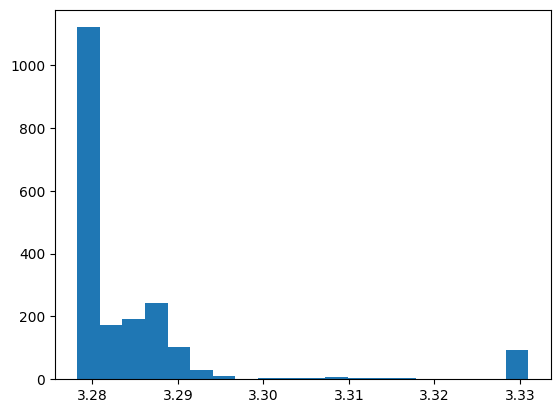
​    


## manipulation du dataset
on insert une colonne timeseries pour faire un affichage séquenciel des valeurs dans un graph (y=value, x=timeseries)


```python
import numpy as np
df['timeseries']=df.index
print(df.head())
print(f"il y a {len(df)} values")
```

         values  timeseries
    0  3.291675           0
    1  3.284731           1
    2  3.295331           2
    3  3.281131           3
    4  3.279421           4
    il y a 1997 values


```python
plt.figure(figsize=(12, 6))
sns.lineplot(x='timeseries', y='values', data=df)

# Afficher le graphique
plt.show()
```


​    
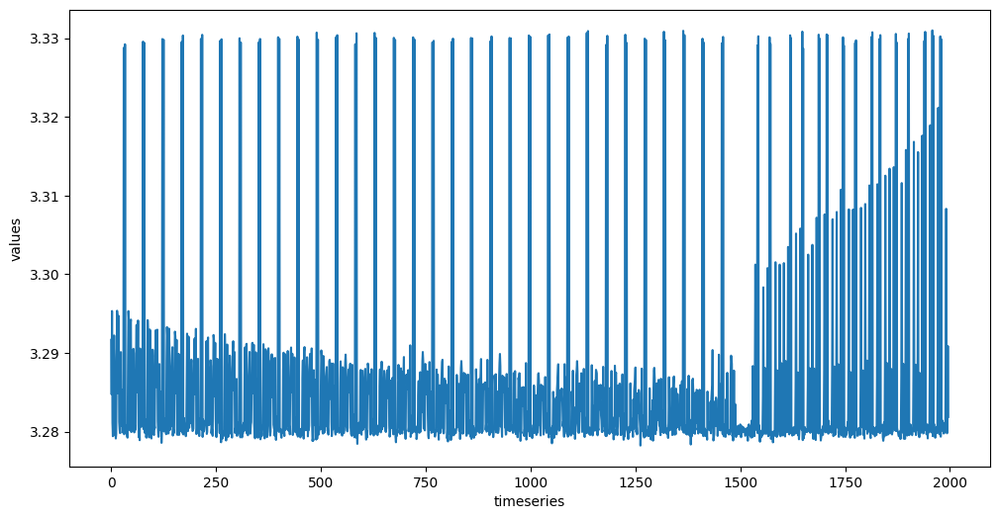
​    


### on a retrouvé le spanausaurus !!
bon maintenant on regarde ce qu'il faut chercher : 10100010100110010100110010100111


```python
# Valeur a trouver dans le signal
e=2727955623
bin_representation = bin(e)[2:]
print(f"exposant {e} est  {bin_representation}")
print(f"il y a {bin_representation.count('1')} un et {bin_representation.count('0')} zero")
```

    exposant 2727955623 est  10100010100110010100110010100111
    il y a 15 un et 17 zero


## Focus sur le signal qui semble matcher avec 15 un


```python
cut_min = 1500
cut_max = 2000

def cut_df(df,cut_min,cut_max):
  df = df[df[('timeseries')] > cut_min]
  df = df[df[('timeseries')] < cut_max]
  df.reset_index(drop=True, inplace=True)
  return df
  
df = cut_df(df,cut_min,cut_max)
plt.figure(figsize=(12, 6))
sns.lineplot(x='timeseries', y='values', data=df)
plt.show()

```


​    
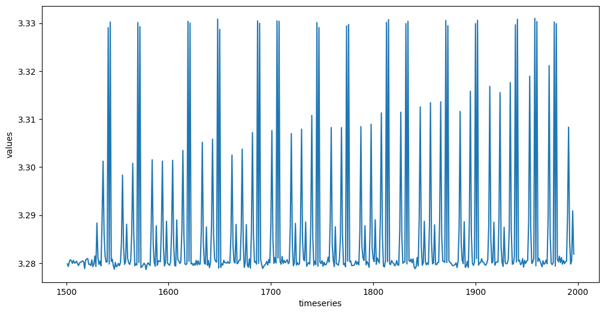
​    


### trouvé?
* on voit bien 15 pics pour les 1
* on va cleaner le signal
  on definit un seuil pour supprimer le bruit


```python
seuil = 3.325

def denoise(df, seuil):
  # On garde les valeurs >= 3.32, on remplace par 0 tout le reste
  df['values'] = df['values'].where(df['values'] >= seuil, 0)
  # On garde les valeurs < 3.32, on remplace par 1 tout le reste
  df['values'] = df['values'].where(df['values'] < seuil, 1)
  return df

df = denoise(df, seuil)
plt.figure(figsize=(12, 6))
sns.lineplot(x='timeseries', y='values', data=df)
plt.show()
```


​    
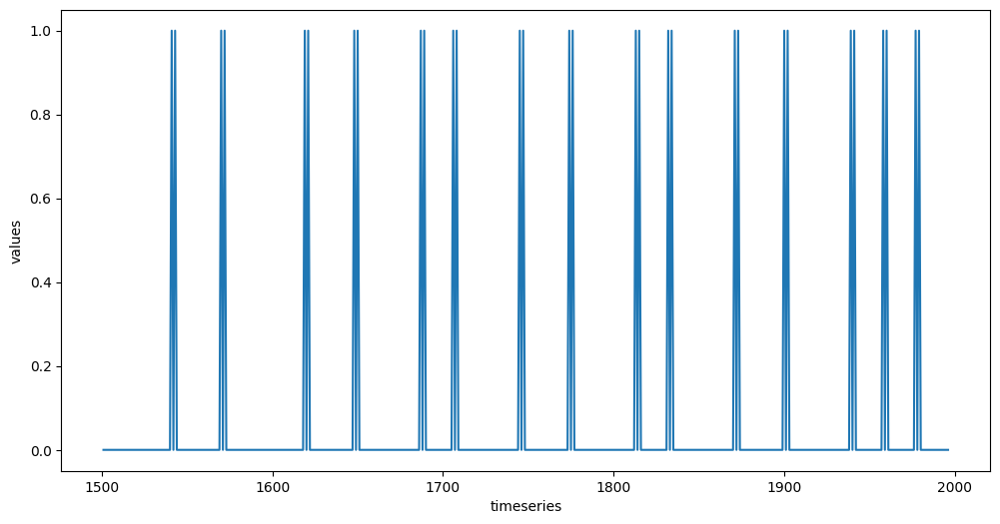
​    


```python
# zoom sur le debut du signal "101..."
plt.xlim(1535, 1577)
sns.lineplot(x='timeseries', y='values', data=df)
plt.show()
pd.set_option('display.max_rows',200)
def show_df(df,start,end):
  print(df[(df['timeseries'] >= start) & (df['timeseries'] <= end)])
show_df(df,1535,1545)
start = 1530
```


​    
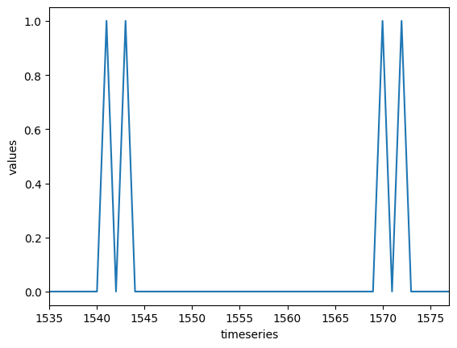
​    


        values  timeseries
    34     0.0        1535
    35     0.0        1536
    36     0.0        1537
    37     0.0        1538
    38     0.0        1539
    39     0.0        1540
    40     1.0        1541
    41     0.0        1542
    42     1.0        1543
    43     0.0        1544
    44     0.0        1545


```python
# focus sur la fin du signal "...111"
plt.xlim(1925,1984)
sns.lineplot(x='timeseries', y='values', data=df)
plt.show()
show_df(df,1970,1985)
end = 1980
```


​    
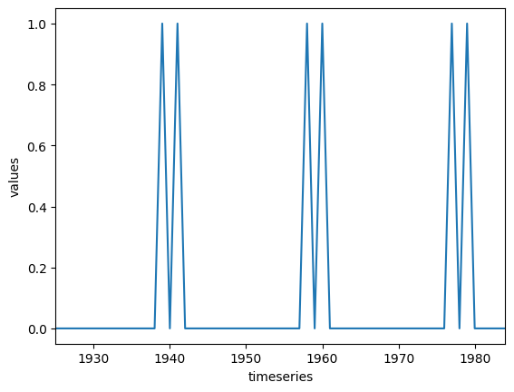
​    


         values  timeseries
    469     0.0        1970
    470     0.0        1971
    471     0.0        1972
    472     0.0        1973
    473     0.0        1974
    474     0.0        1975
    475     0.0        1976
    476     1.0        1977
    477     0.0        1978
    478     1.0        1979
    479     0.0        1980
    480     0.0        1981
    481     0.0        1982
    482     0.0        1983
    483     0.0        1984
    484     0.0        1985


```python
# focus sur le signal 10100010100110010100110010100111
def show_signal(df,start,end):
  print(start, end)
  plt.figure(figsize=(12, 6))
  plt.xlim(start, end)
  sns.lineplot(x='timeseries', y='values', data=df)
  plt.show()
show_signal(df,start,end)
```

    1530 1980


    


* On va chercher l'ecart entre 2 bits. On va calculer tous les delta des 1 (distance entre chaque 1)
* on a vu que les 1 sont 101 en zoomant sur le signal, donc choisi que le premier de chaque


```python
# on cherche les index des 1
def analyse_un(df):
  un_indexes = []
  for i in range(1,len(df),1):
    if df['values'].iloc[i] == 1 and df['values'].iloc[i-2] !=1 :
      un_indexes.append(i)
  print("les index des 1 sont:")
  print(un_indexes)
  print(f"il y a {len(un_indexes)} un")
  delta_un = []
  for i in range(0,len(un_indexes)-1,1):
    delta_un.append(un_indexes[i+1]-un_indexes[i])
  print("les deltas entre chaque un sont :")
  print(delta_un)
  step = min(delta_un)
  print(f"le plus petit delta entre 2 un est de {step}")
  return step

step = analyse_un(df)
show_signal(df, start,end)
```

    les index des 1 sont:
    [40, 69, 118, 147, 186, 205, 244, 273, 312, 331, 370, 399, 438, 457, 476]
    il y a 15 un
    les deltas entre chaque un sont :
    [29, 49, 29, 39, 19, 39, 29, 39, 19, 39, 29, 39, 19, 19]
    le plus petit delta entre 2 un est de 19
    1530 1980


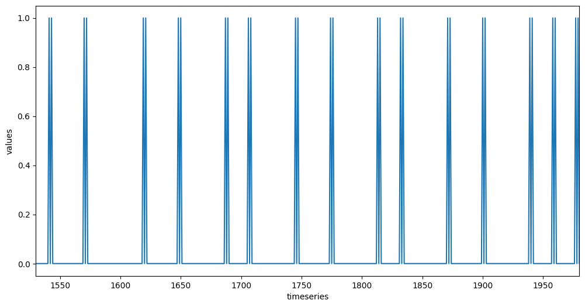
    


* on a bien trouvé 15 un
* l'ecart semble de 19 valeurs entre chaque bit (distance mini 19)

## on amplifie le signal
* pour faciliter le decodage, on va amplifier le signal.
* on va elargir les 1 mais eviter qu'ils se chevauchent.


```python
largeur = step - 5

print(largeur)
def amplifie_1(df,largeur):
  # on met carre les 1 et on amplifie le signal (101 en 111 et on elargie le signal 111 => 1111111)
  try:
    for i in range(1,len(df)-1,1):
      if df['values'].iloc[i] == 0 and df['values'].iloc[i-1] == 1 and df['values'].iloc[i+1] == 1: 
        df.loc[i-largeur:i, 'values'] = 1
  except e:
    print(e)
  return df

df = amplifie_1(df,largeur)
show_signal(df,start,end)
# 10100010100110010100110010100111
```

    14
    1530 1980


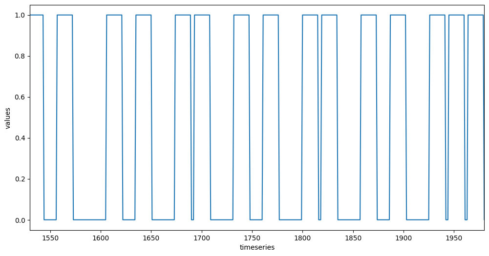
    


* on amplifie aussi les 0 pour detecter les suites de 0


```python
# on met carre les 0 et on amplifie les 0 : on transforme de longue serie de 0 en -1
def amplifie_0(df,largeur):
  try:
    for i in range(1, len(df)-1, 1):
      sum = df.loc[i:i+largeur]['values'].sum()
      if df['values'].iloc[i] == 0 :
        if sum > 10:
          next
        else:
          df.loc[i+2:i+largeur-2,'values'] = -1
  except e:
    print(e)
  return df

df = amplifie_0(df,largeur)
# on a amélioré le rapport 1/0
show_signal(df,start,end)
# 10100010100110010100110010100111
```

    1530 1980


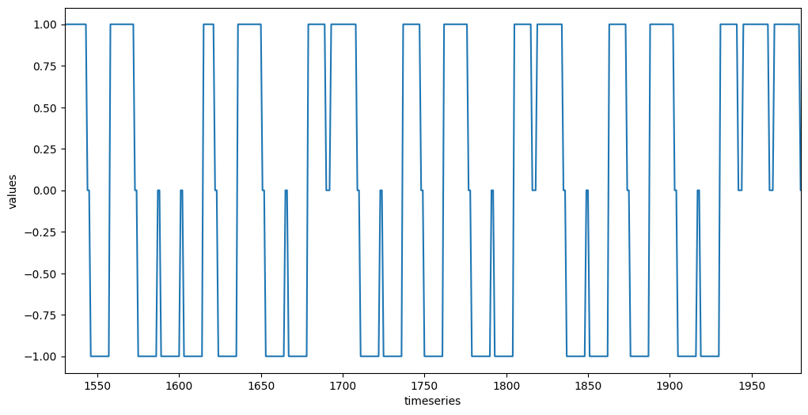
    


* on peut deja lire visuellement le signal
codons une premiere version pour le faire automatiquement


```python
# lit le signal amplifié

def decode_signal(df,largeur,t0,step):
    binary = ''
    for i in range(t0, len(df)-t0, step):
        sum = df.loc[i:i+largeur]['values'].sum()
        if sum > 0:  # on detecte un 1
            binary += "1"
        elif sum < 0: # on detecte un 0
            binary += "0"
        else:
            binary += "?"
            print("?",sum) # on tune les seuil de detection
    return binary

# print(df.head())
index0 = df[df['timeseries'] == start].index[0]
indexN = df[df['timeseries'] == end].index[0]
hop = (indexN - index0) // 32
print(f"largeur bit {largeur}")
print(f"premier index {index0}")
print(f"fin index {indexN}")
print(f"il faut 32 saut de {hop}index")
binary = decode_signal(df,10,index0,hop)
print(binary, f"decode size {len(binary)}")  # decodé
print(bin_representation, "cible")  # target
print(binary[:32] == bin_representation) # on a trouvé ?
n_decode = int(binary, 2)
print(f"n decode {n_decode}")
```

    largeur bit 14
    premier index 29
    fin index 479
    il faut 32 saut de 14index
    10100010100110010100110010100111 decode size 32
    10100010100110010100110010100111 cible
    True
    n decode 2727955623


# analyse target trace admin
passons a la deuxieme trace


```python
df2 = pd.read_csv('trace_admin.csv')
df2.columns = ['values']
df2['timeseries'] = df2.index
print(df2.head())
print(f"il y a {len(df2)} values")
show_signal(df2,0,len(df2))
```

         values  timeseries
    0  3.291074           0
    1  3.283038           1
    2  3.297876           2
    3  3.280763           3
    4  3.279797           4
    il y a 2024 values
    0 2024


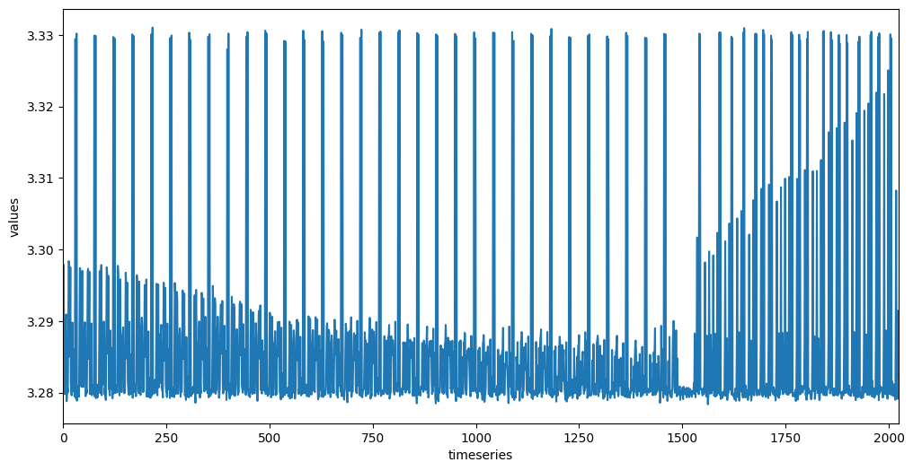
    


```python
# premieres estimation debut fin signal
start2 = 1500
end2 = len(df2)

show_signal(df2,start2,end2)
```

    1500 2024


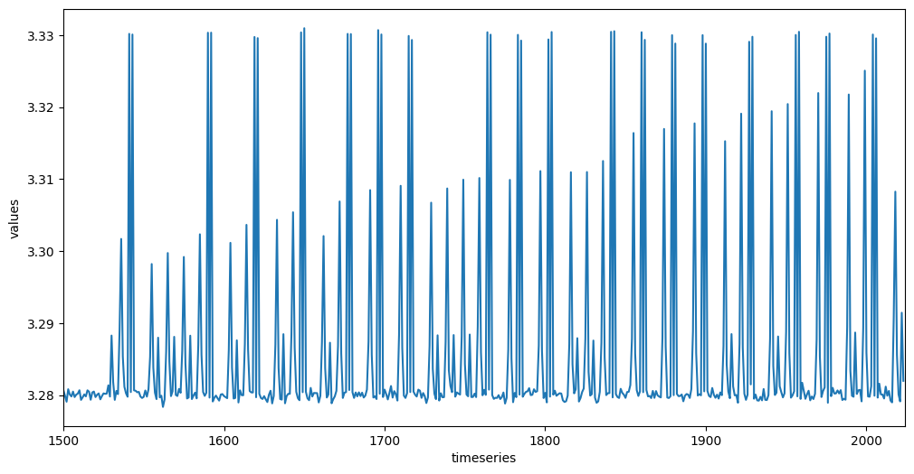
    


```python
# on coupe le dataset, on semble avoir tout le signal
print(start2,end2)
df2 = cut_df(df2,start2,end2)
show_signal(df2,start2,end2)
```

    1500 2024
    1500 2024


    


```python
# on clean le signal
seuil2 = 3.326
df2 = denoise(df2, seuil2)
show_signal(df2, start2, end2)
```

    1500 2024


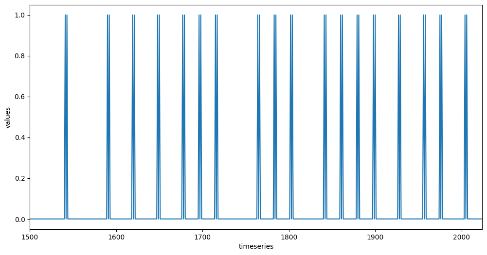
    


```python
# focus premier 1
show_signal(df2,1500,1550)
# show_df(df2, 1528, 1550)
start2 = 1530  
```

    1500 1550


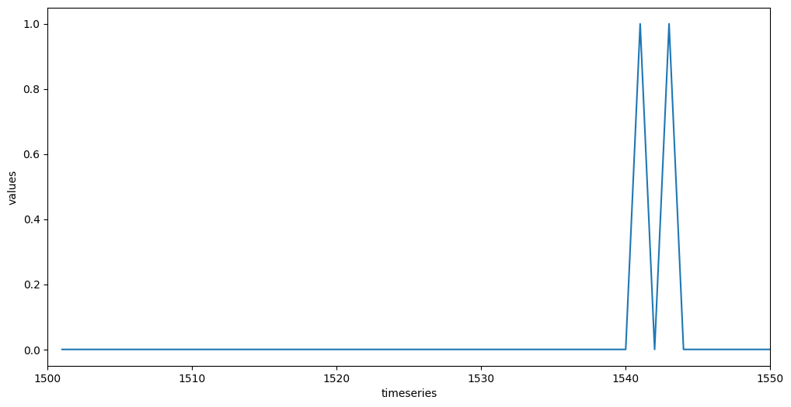
    


```python
# focus dernier 1
show_signal(df2,2000,end2)
# show_df(df2,2000,2015)
end2 = 2008
```

    2000 2024


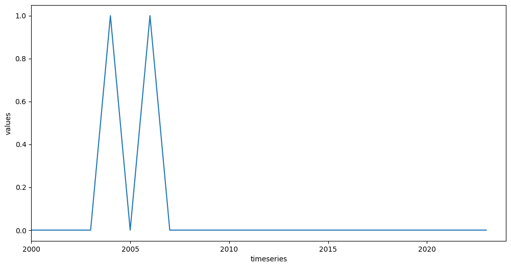
    


```python
show_signal(df2, start2,end2)
```

    1530 2008


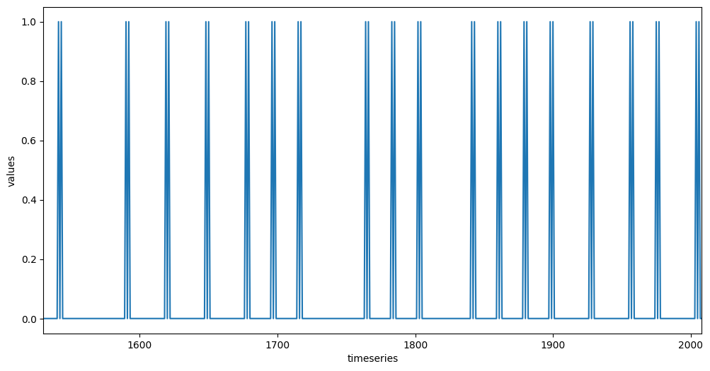
    


```python
# on cherche les index des 1
step2 = analyse_un(df2)
```

    les index des 1 sont:
    [40, 89, 118, 147, 176, 195, 214, 263, 282, 301, 340, 359, 378, 397, 426, 455, 474, 503]
    il y a 18 un
    les deltas entre chaque un sont :
    [49, 29, 29, 29, 19, 19, 49, 19, 19, 39, 19, 19, 19, 29, 29, 19, 29]
    le plus petit delta entre 2 un est de 19


* les delta sont bien les memes
* on va amplifier le signal 1 et 0


```python
# largeur = len(df2) // 32
df2 = amplifie_1(df2, largeur)
show_signal(df2, start2,end2)
```

    1530 2008


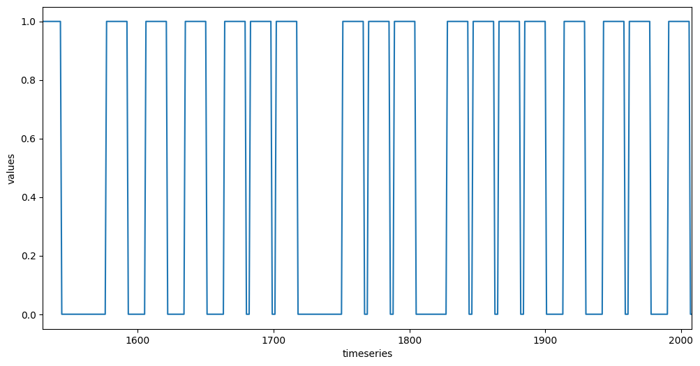
    


```python
df2 = amplifie_0(df2,largeur)
show_signal(df2,start2,end2)
```

    1530 2008


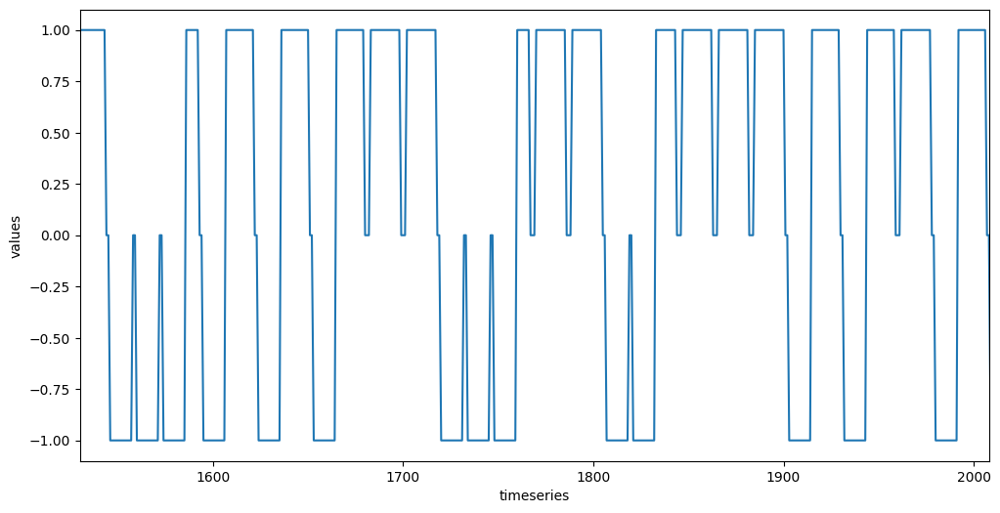
    


### On peut deja decoder visuellement le signal
et on en profite pour prendre le flag


```python
# visuellement on peut traduire le signal:
target="10001010101110001110011110101101"
print(f"FCSC{{{int(target,2)}}}")
```

    FCSC{2327373741}


*Bingo* !
bon on se le decode pour le plaisir automatiquement avec une autre méthode:
* on parcourt le signal a la recherche d'alternance entre les 1 et les -1
* on ajoute un bit decouvert a chaque alternance


```python
# nouvelle methode pour traduire le signal
def decode_2(df):
  binary = ''
  i = -1
  while(i < len(df)-2):
    i+=1
    if df['values'].iloc[i] == 1:       # 1 detecté
      binary += '1'
      while(df['values'].iloc[i+1] == 1):
        i += 1                          # on skip le signal jusqu'a la prochaine variation
    elif df['values'].iloc[i] == -1:    # 0 detecté
      binary += '0'
      while(df['values'].iloc[i+1]== -1 ):
        i += 1                          # on skip le signal jusqu'a la prochaine variation
    else:
      i+=1
  return binary


binary = decode_2(df2)
print(binary, "decode auto size",len(binary))
print(binary[2:34],"decode aligne 32bits")
print(target,"visuel precedent")
dec2 = binary[2:34]
print(dec2,"decode chosen 32 bits")
print("match",dec2 == target)
print(f"FCSC{{{int(dec2,2)}}}")
```

    00100010101011100011100111101011010 decode auto size 35
    10001010101110001110011110101101 decode aligne 32bits
    10001010101110001110011110101101 visuel precedent
    10001010101110001110011110101101 decode chosen 32 bits
    match True
    FCSC{2327373741}

